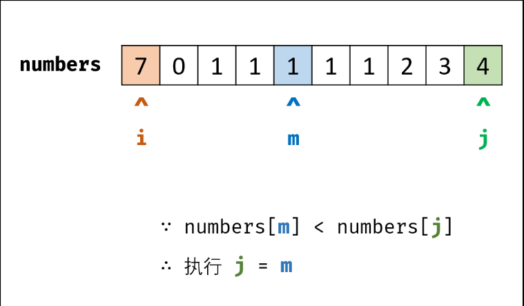
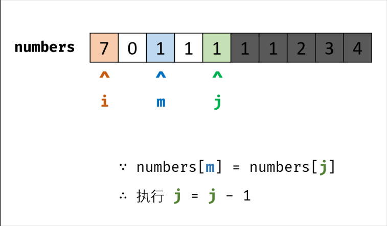
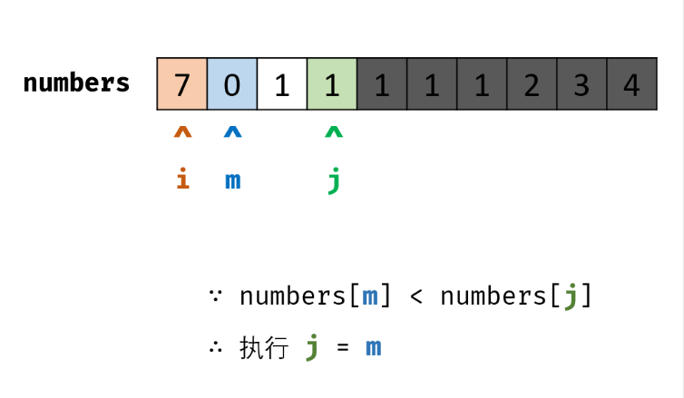
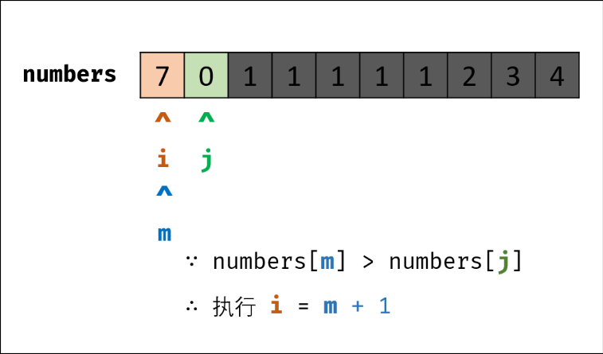
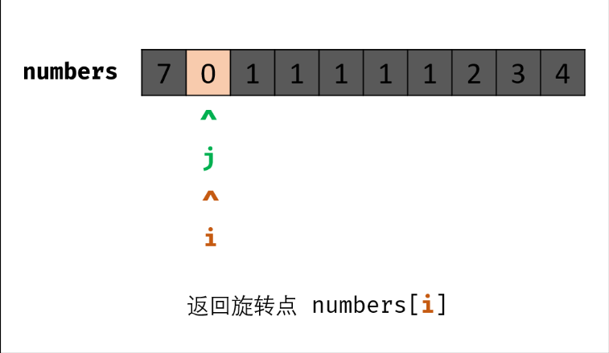

# 旋转数组的最小数字

## 题目描述

把一个数组最开始的若干个元素搬到数组的末尾，我们称之为数组的旋转。
输入一个非递减排序的数组的一个旋转，输出旋转数组的最小元素。
例如数组{3,4,5,1,2}为{1,2,3,4,5}的一个旋转，该数组的最小值为1。
NOTE：给出的所有元素都大于0，若数组大小为0，请返回0。。

## 思路

设置 `left`, `right` 指针分别指向 `numbers` 数组左右两端，`mid = mid = Math.floor((left + right) / 2)` 为每次二分的中点），可分为以下三种情况：

- 当 `numbers[mid] > numbers[right]` 时： `mid` 一定在左排序数组中，即旋转点 `mid` 一定在 `[mid+1,right]` 闭区间内，因此执行 `left = mid + 1`；
- 当 `numbers[mid] < numbers[right]` 时： `mid` 一定在右排序数组中，即旋转点 `mid` 一定在 `[left,mid+1]` 闭区间内，因此执行 `right = mid`；
- 当  `numbers[mid] === numbers[right]`  时： 无法判断  `mid` 在哪个排序数组中，即无法判断旋转点 `mid` 在`[mid+1,right]`还是`[left,mid+1]`区间中。解决方案： 执行`right=right-1` 缩小判断范围

当 `left===right` 时跳出二分循环，并返回 `numbers[left]` 即可。











## 代码

```javascript
var minArray = function (numbers) {
  if (!numbers.length) {
    return 0;
  }
  let left = 0,
    right = numbers.length - 1,
    mid;
  while (left < right) {
    mid = Math.floor((left + right) / 2);
    if (numbers[mid] > numbers[right]) {
      left = mid + 1; 
    } else if(numbers[mid] < numbers[right]){
      right = mid; 
    } else {
      right--
    }
  }
  return numbers[left]
};
```

